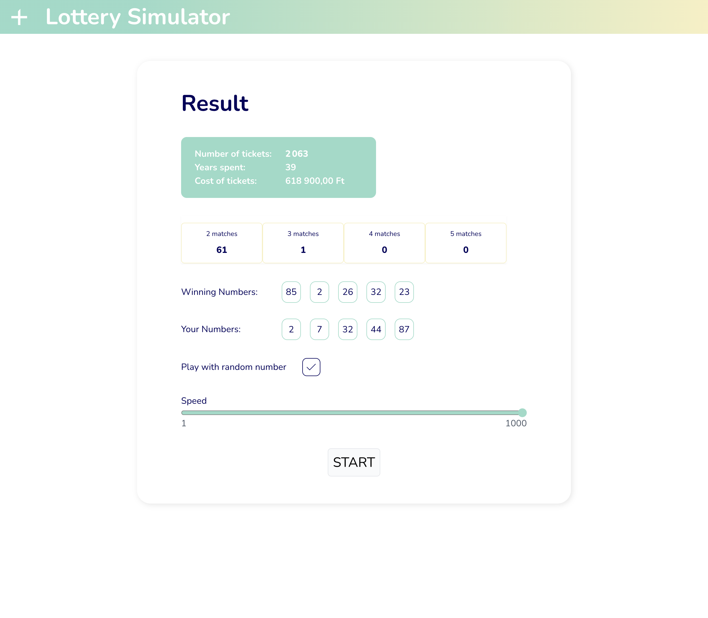

# Lottery Simulator

This is a lottery simulator game created using Vue.js, Vuex and Tailwind css.

    

## Vuex Store

The Vuex store contains the following data:

- **ticketNumber**: the number of tickets sold.
- **date**: the date and time when the game is played.
- **winningNumbers**: an array of five random numbers as winning numbers.
- **yourNumbers**: an array of five numbers selected by the player.
- **matches**: an object that contains the number of matches for each player's ticket.
- **isRunning**: a boolean value that indicates whether the game is running or not.
- **isRandomPlay**: a boolean value that indicates whether the player is playing randomly numbers or not.
- **speed**: the speed of the game.

## Development

### Prerequisites

- Node.js version 12 or higher
- NPM or Yarn

### Setup

1. Clone the repository to your local machine: git clone https://github.com/nagybnc/lottery-simulator.git
2. cd lottery-simulator
3. npm install
4. npm run dev
